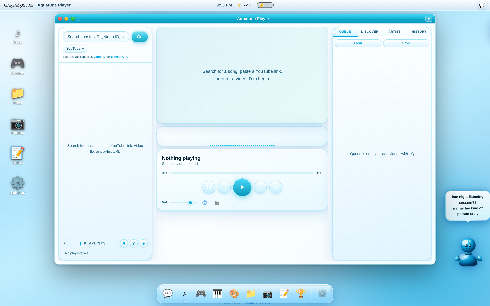

<div align="center">
  

  <h1>AquaTune</h1>

  <p><strong>A nostalgic desktop-OS in your browser — synced music rooms, a YouTube-powered player, mini-games, and a wall of switchable retro themes.</strong></p>

  <p>
    <a href="https://j13.us">Live app → j13.us</a>
  </p>

  
</div>

---

## What is it?

AquaTune is a single-page web app that boots into a full **desktop operating system** — complete with a
menu bar, draggable windows, a dock, wallpaper, and a buddy in the corner. At its heart is a YouTube-backed
music player you can run **solo** or in **synced listening rooms** with friends, wrapped in a stack of
lovingly recreated retro themes (Aqua/Mac OS X, Windows 95/XP, Aero, BeOS, Wii, Dreamcast, Y2K, Neon, and more).

It's all **one `index.html`** (vanilla JS, no framework) bundled with Vite, plus a small ES-module layer for
Firebase realtime sync and an optional browser extension that feeds the audio visualizer.

## Features

### 🎧 Music
- **YouTube player** — search, paste a link/video ID, or queue a playlist.
- **Queue, playlists, history & discover** tabs; shuffle and auto-mix.
- **Solo mode** or **listening rooms** — create a room as host, share the code, and everyone stays in sync.
- **Audio visualizer** that reacts to the music (see the extension below for true YouTube audio).

### 👥 Rooms, chat & sync
- Realtime room state over **Firebase** — play/pause/seek/skip propagate to every guest within ~1s.
- **Host persistence** across reloads, late-joiner snap-to-position, and mobile-friendly autoplay handling.
- **AquaChat** board + per-room chat with avatars and emoji.
- **Themed pop-up notifications** — new chat messages slide in as little top-right cards styled to match
  whatever theme you're running.

### 🎮 Mini-games & rewards
- **Slots, Solitaire, Picross, Minesweeper, Blackjack, Beat Tap, Texas Hold'em, and Space Pinball.**
- A **global leaderboard** (with an *Anonymous* fallback) and an in-app **credits** economy.
- **Unlockable themes** earned by playing — e.g. solve a Picross, win Solitaire, or hit a Slots jackpot.
- Picross supports **click-and-drag fill** and **crosses off clue numbers** as you complete them.

### 🎨 Themes
A whole shelf of eras, each with light/dark variants — Mac (Aqua, Classic, Metal, BeOS), Windows
(3.1, 95, XP, Aero), consoles (Wii, Dreamcast), and fun skins (Y2K, Neon, Pixel, MySpace, Mono-90s). Every
piece of chrome — windows, toasts, notifications — re-styles automatically via CSS variables.

## Getting started

```bash
# install dependencies
npm install

# run the dev server (Vite)
npm run dev

# production build → dist/
npm run build

# preview the production build
npm run preview
```

> **Realtime features (rooms, chat, leaderboard)** need a Firebase Realtime Database. Configure your Firebase
> project in `src/firebase.js` / `src/chat-firebase.js`. Without it, the app still runs great in **Solo Mode**.

## Browser extension (optional) — real YouTube audio for the visualizer

A page can't read audio from a cross-origin YouTube iframe, so the visualizer normally falls back to the
app's own analyser. The bundled **Manifest V3 extension** in [`extension/`](extension/) taps YouTube's
`<video>` via the Web Audio API and streams FFT data to AquaTune, so the bars dance to the actual track.

```
extension/
├── manifest.json      # MV3 (Chrome/Edge/Brave + Firefox notes)
├── yt-capture.js      # captures YouTube audio → FFT
├── background.js      # service-worker relay
├── aq-bridge.js       # content script on the AquaTune origin
├── aq-page-shim.js    # exposes window.__aqExtAnalyser to the page
└── icons/
```

Load it unpacked (`chrome://extensions` → *Developer mode* → *Load unpacked* → select `extension/`). See
[`extension/README.md`](extension/README.md) for full setup and Firefox notes.

## Project structure

```
.
├── index.html        # the entire app (UI, player, games, themes, OS shell)
├── src/
│   ├── firebase.js       # Firebase app + Realtime DB handle
│   ├── chat-firebase.js  # chat/board sync
│   └── room-sync.js      # room host/guest state synchronization
├── extension/        # optional MV3 audio-capture extension
├── public/           # static assets
├── docs/             # screenshots / docs assets
├── privacy.html · terms.html
└── vite.config.js
```

## Tech stack

Vanilla JS · Vite · Firebase Realtime Database · YouTube IFrame API · Web Audio API · Canvas. No UI framework.

## Deployment

Static build (`dist/`) deployable anywhere — the live site runs at **[j13.us](https://j13.us)** (see `CNAME`),
with a `netlify.toml` for Netlify hosting.

---

<div align="center"><sub>Built with 💧 — AquaTune</sub></div>
